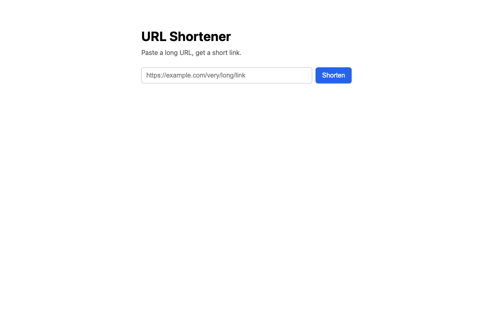
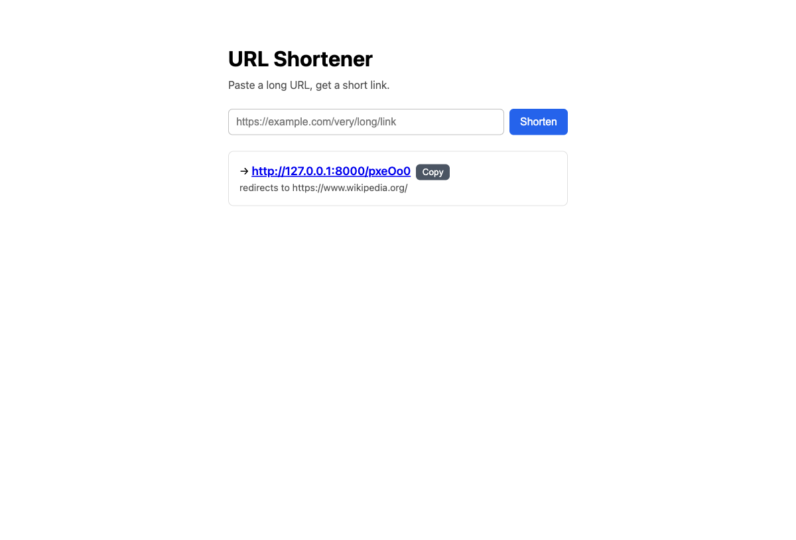

# url-shortener-aws

A containerized URL shortener deployed on AWS with Terraform — built to learn
the cloud-engineering plumbing that serverless projects hide: **Terraform,
containers, VPC networking, CI/CD, and observability**.

The app is small on purpose. The infrastructure is the point.

## What it does

`POST` a long URL, get a short code back. Visiting the short URL redirects to the
original and logs the click. FastAPI (Python) in a container, backed by Postgres.

## Try it locally (no AWS)

The app is designed to run without any cloud account — it reads its database
connection from a `DATABASE_URL` env var instead of AWS Secrets Manager when one
is present. One command stands up the same container image plus a local Postgres
(standing in for RDS), bound to loopback only:

```bash
./scripts/run_local.sh up         # build + start → http://127.0.0.1:8000
./scripts/run_local.sh down       # stop + remove everything
```

Then open <http://127.0.0.1:8000> and shorten a link in the browser. If you have
the Docker Compose plugin, `docker compose up --build` does the same thing
(`docker-compose.yml`). Requires only Docker (e.g. Colima or Docker Desktop).

The lightweight web UI (Phase 7) — paste a URL, get a short link back:




## Architecture

```
Internet → ALB → ECS Fargate (FastAPI container) → RDS Postgres (private)
```

See `CLAUDE.md` for the full diagram and the deliberate cost choices
(free-tier / tear-down: no NAT gateway, db.t4g.micro, destroy when idle).

## Notable design decisions

- **Runs on ARM64 / AWS Graviton** for ~20% lower compute cost. The build side
  (Docker image + GitHub Actions runner) is kept ARM64 to match the runtime, so
  build and run architectures stay aligned. See `CLAUDE.md` / `docs/PLAN.md` for
  the trade-offs and how to port to x86 (or build a multi-arch image) if needed.
- **Keyless CI/CD** — GitHub Actions authenticates to AWS via OIDC, so no
  long-lived AWS keys are stored in GitHub.
- **Database isolated in private subnets**, reachable only by the app's security
  group; credentials live in Secrets Manager, never in code or the image.
- **Everything is Terraform** — reproducible (`apply`) and disposable
  (`destroy`), with no resources created by hand in the console.

## Layout

| Path | What's there |
|------|--------------|
| `infra/` | Terraform — all AWS resources (the source of truth) |
| `app/`   | FastAPI app + Dockerfile |
| `scripts/` | Helper scripts (`run_local.sh` to run it locally, `seed_demo.py` to seed demo links) |
| `docker-compose.yml` | One-command local run (app + Postgres), no AWS |
| `.github/workflows/` | CI/CD — GitHub Actions deploy pipeline (OIDC, keyless) |
| `docs/PLAN.md` | The phase-by-phase build plan |
| `CLAUDE.md` | Project guidance + phase status |

## Working with the infrastructure

```bash
cd infra
terraform init      # one-time: download the AWS provider
terraform plan      # preview what will be created/changed
terraform apply     # create the resources (prompts for confirmation)
terraform output    # reprint VPC / subnet IDs etc.
terraform destroy   # tear everything down (do this when done for the day)
```

Requires the AWS CLI configured with credentials (`aws configure`) and Terraform
installed.

## Status

Phases 1–6 built and verified on live AWS (networking, container, Fargate + ALB,
RDS + Secrets Manager, a keyless GitHub Actions + OIDC deploy pipeline, and
observability — CloudWatch dashboard, structured logs, and alarms that fire and
recover through SNS). Phase 7 added a lightweight web UI and a one-command local
runner (above). Built to be stood up and torn down on demand — $0 when idle.
See `docs/PLAN.md`.
